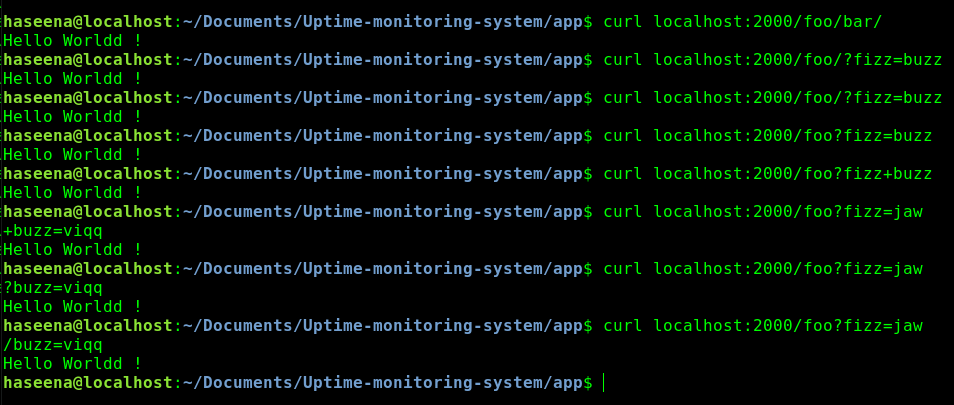
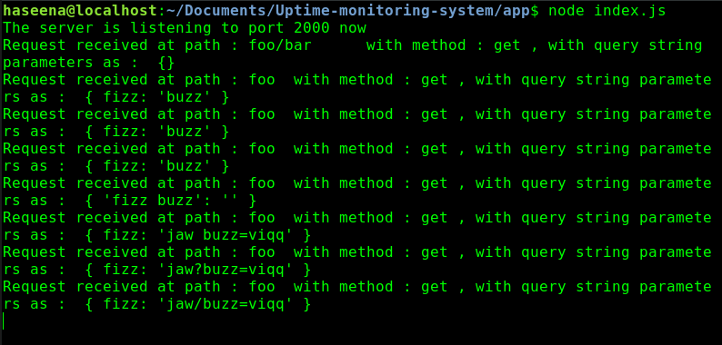
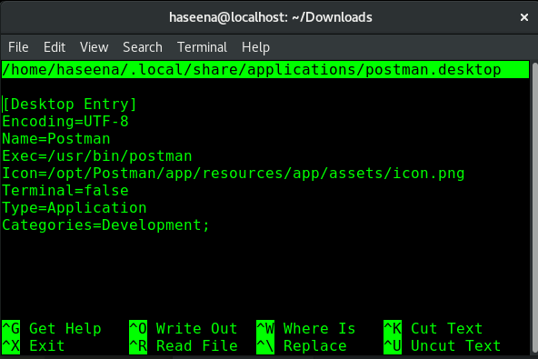
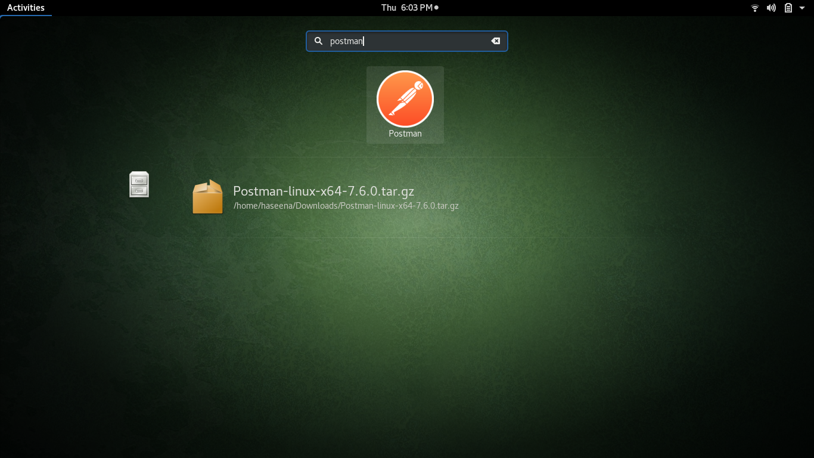
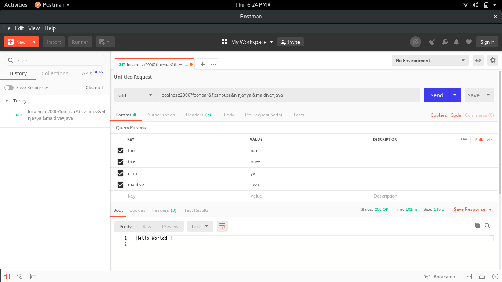
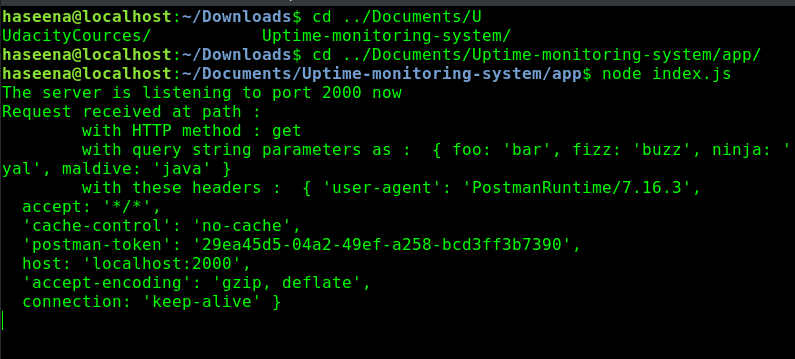

### How it looks like on running index.js each time !! (sounds nice ryt ;) 


#### Parsing the request path

 


#### Parsing the query string parameters

 


#### Parsing headers from the request

* Here, instead of curl we use postman
    * Postman is a HTTP request library that is useful for debugging APIs while building them. It lets us form requests at the headers we want to send at the body we wanna send very easily

    ##### How to install or update postman on Linux

    ``` 
    Postman Makes API Development Simple. This method is verified for Ubuntu, Debian, Fedora, OpenSuse.
    ```
    

    1. Go to the Postman app download [page](https://www.getpostman.com/apps) . Choose the os version from the drop-down. x64 for 64 bit Operating System and x84 for the 32 bit based Linux.


    2. Open the terminal and go to the directory where you have downloaded the tar file. If you have downloaded on the Downloads folder,  
   
    ```bash
    cd ~/Downloads/
    ```

    3. Run the following commands,
   
    ```bash
    sudo rm -rf /opt/Postman/
    sudo tar xvf Postman-<your version>.tar.gz -C /opt/
    sudo ln -sf /opt/Postman/app/Postman /usr/bin/postman
    ```

    4. create a file for the desktop entry so you can easily search the Postman app like any other app in your computer.
   
    ```bash
    nano ~/.local/share/applications/postman.desktop
    ```

    5. Write the following in the file.
   ```
    [Desktop Entry]
    Encoding=UTF-8
    Name=Postman
    Exec=/usr/bin/postman
    Icon=/opt/Postman/app/resources/app/assets/icon.png
    Terminal=false
    Type=Application
    Categories=Development;
    ```

    6. Save the file .
    

    7. Now, if you would search for Postman in unity or gnome, you can see the Postman app. 

    

   

    
