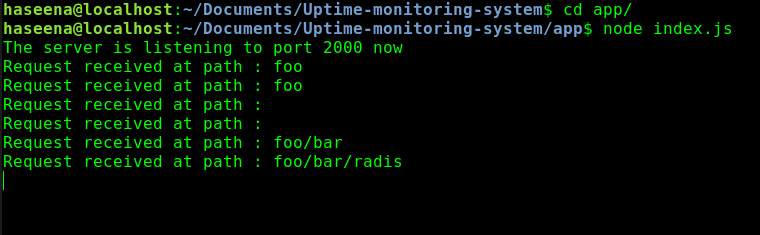

### How it looks like on running index.js each time !! (sounds nice ryt ;) 

#### Parsing the request path

 

#### Parsing the query string parameters

 

#### Parsing headers from the request

* Here, instead of curl we use postman
    * Postman is a HTTP request library that is useful for debugging APIs while building them. It lets us form requests at the headers we want to send at the body we wanna send very easily

    ##### [How to install or update postman on Linux](postman.md)

      
   
      
    
